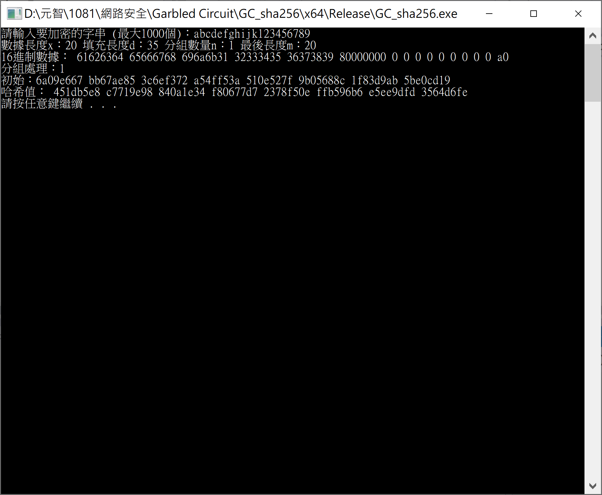
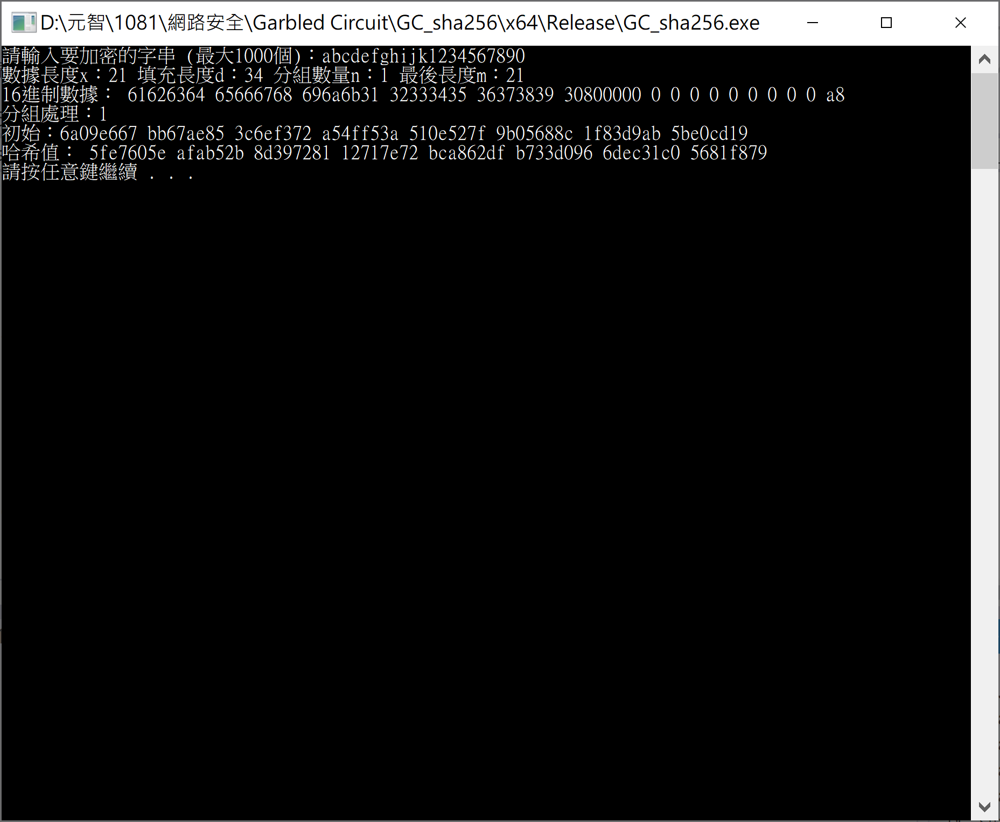

# Project6-2_Garbled_circuit

## 20200107版

#### 原版使用C++及python撰寫，因程式之間需藉由讀寫檔方式交換資訊，造成效率低落且執行結果不如預期。
### 新版全部功能改由C++撰寫，除了修正原有錯誤外，執行時間降低為1秒。

```
新版程式：https://github.com/cislab-yzu/Project6-2_Garbled_circuit/tree/master/20200107_SHA256

執行方式：編譯並執行20200107_SHA256中的7個檔案及6個電路檔(資料夾外的.txt檔)，輸入要加密的字串，即可得到哈希值。

執行結果圖：
輸入相同字串，哈希值相同
輸入字串相近，哈希值差異顯著
```




## 舊版

代碼實現以garbled circuit運算2-bit的g^x mod 3之模運算  
使用者需輸入2-bit的x和g，作為garbled circuit的input  
透過下圖電路設計，會得到2-bit計算結果的output  
(邏輯閘上方的編號是依據程式設計之結構，可參考circuit.json)


加密方式:


討論模運算:
* 原本方法:
1.利用二進位的表示法進行運算，將次方後的結果與mod p做一個XOR運算，二進位的結果會與直接計算的答案相同。
2.利用暴力破解的表格法，從其找出規律，但在p為非質數時會錯。
* 最終方法:
不能用number level找規律(原本方法都始於number level)，因number level沒辦法看出每個值之間bit的變化，所以我們必須用bit level，直接畫出2bits的truth table並進行電路的化簡。

g^x mod 2(過於簡單所以採用g^x mod 3):


g^x mod 3:


## 10/22討論
工作分配(先做2bit):
黃子庭:撰寫加密程式
吳芷芳:撰寫加密程式
胡嘉芸:撰寫加密程式
張楚翎:想電路+文件
徐永棚:想電路+文件
陳睿暘:想電路+文件
張峻維:想電路+文件
